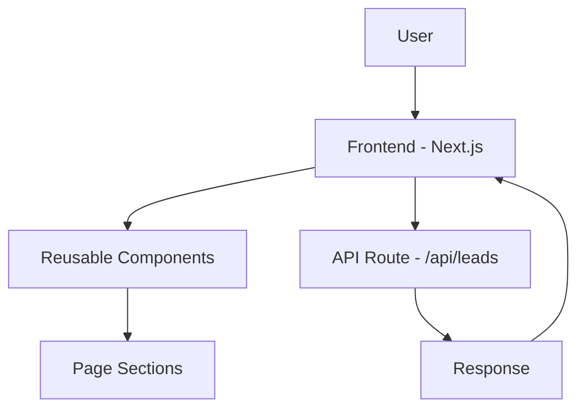
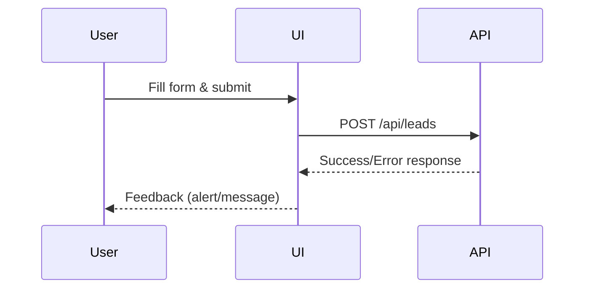

# 🚀 Accredian Enterprise Clone

A responsive recreation of the Accredian Enterprise landing page built using **Next.js**, focused on clean UI, reusable components, animations, and a functional lead capture flow.

🔗 Live: https://accredian-clone-chi.vercel.app/
🔗 Reference: https://enterprise.accredian.com/

---

## ⚙️ Setup & Run Locally

Follow these steps to run the project on your machine:

### 1. Clone the repository

git clone https://github.com/Prabh0608/accredian-clone.git

### 2. Navigate to the project directory

cd accredian-clone

### 3. Install dependencies

npm install

### 4. Start the development server

npm run dev

### 5. Open in browser

Visit: http://localhost:3000

---

## 🧠 Approach

- Analyzed reference for **layout, hierarchy & conversion flow**
- Built using **modular, reusable components**
- Followed **mobile-first responsive design**
- Added **animations for better UX**
- Implemented **lead capture with API route**

---

## 🏗️ System Architecture

---

## 🔄 Request Flow (Lead Capture)

---

## 🤖 AI Usage

AI was used as a **development assistant**:

- Helped with component structure
- Assisted in debugging & UI improvements
- Suggested animations and refinements

**Note:**
A significant portion of base code and suggestions were AI-assisted,
but everything was **reviewed, modified, and implemented manually**.

---

## 🛠️ Manual Work

- UI layout, spacing, and responsiveness
- Animation tuning
- Component structuring
- Lead form + API integration
- Final testing and refinements

---

## ✨ Key Highlights

- Clean, responsive UI
- Reusable component architecture
- Smooth animations
- Functional frontend + API flow
- Balanced AI + manual implementation

---

## 🚧 Improvements (if more time)

- Better micro-interactions
- Form validation + database integration
- Testimonials / dynamic sections
- Reusable design system
- Accessibility improvements

---
